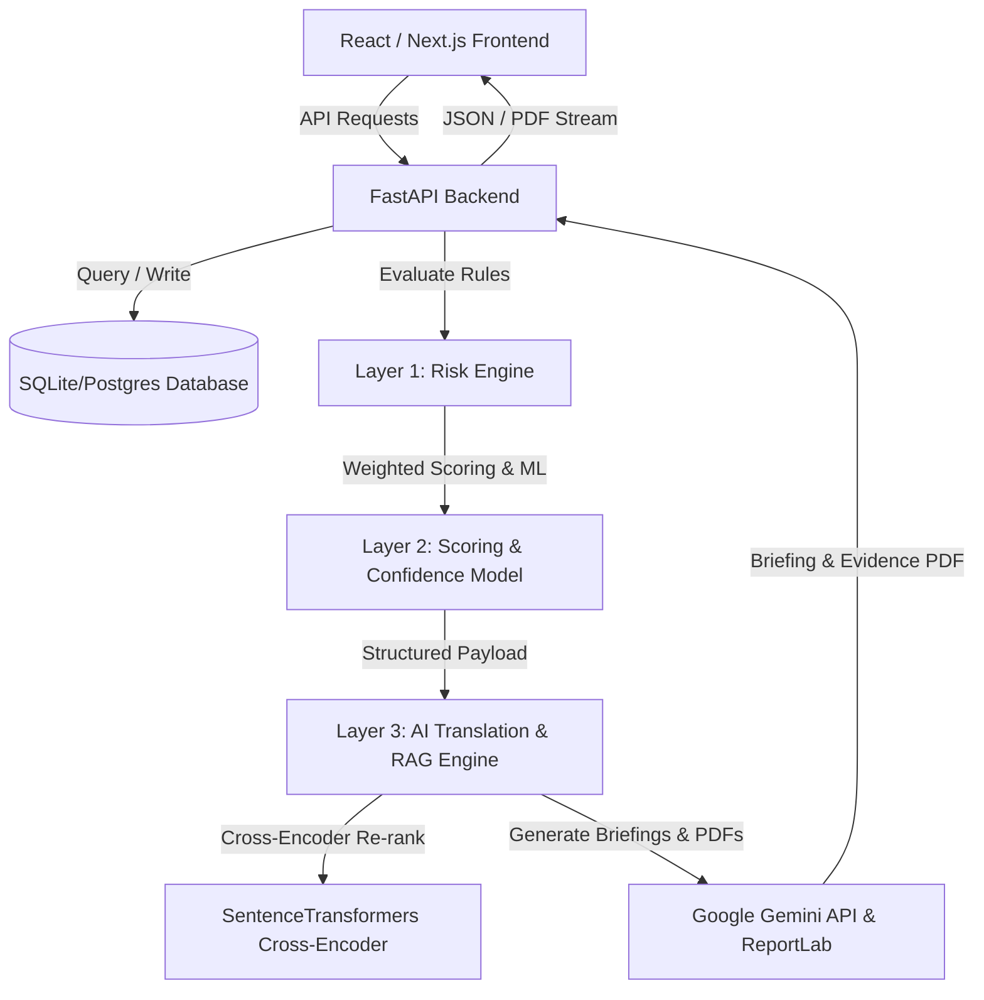

# 🛡️ SentinelGrid: Compound-Risk Detection for Industrial Safety

SentinelGrid is a cutting-edge, multi-layered risk correlation engine designed for industrial plant safety. While traditional SCADA and DCS control room systems monitor individual telemetry streams in silos (waiting for static gas alarms to cross high thresholds), SentinelGrid correlates real-time **gas sensor telemetry**, active **work permits**, and **maintenance databases** to flag compound hazards hours before they escalate into incidents.

By combining deterministic rule-based correlation (Layer 1), weighted aggregate risk scoring and machine-learning explainability (Layer 2), and LLM-driven natural language safety translation and cross-encoder RAG (Layer 3), SentinelGrid provides site safety officers with predictive foresight, downloadable regulatory evidence packets, and counterfactual simulation sandboxes.

---

## 🚀 Key Capabilities & Features

### 1. Geospatial Heatmap & Floor Plan
- **HTML5 Canvas Risk Layer**: Positioned directly under the SVG zone layout, rendering smooth HSL Gaussian intensity blobs representing dynamic gas accumulation and zone risk scores.
- **Interactive Zone Mapping**: Maps real-time hazardous conditions across six distinct plant zones (`Zone-A` through `Zone-F`) with dynamic status indicators (Normal 🟢, Alert 🟡, and Danger/Escalate 🔴 with pulsing warning glows).

### 2. Multi-Layered Correlation & Safety Engine
*   **Layer 1 — Deterministic Correlation Rules**: Cross-references telemetry streams to evaluate multi-factor risks (e.g., active hot work near rising combustible gas in a zone with an overdue exhaust fan check).
*   **Layer 2 — Aggregate Risk Scoring & ML Explainability**: Calculates a dynamic Risk Index ($0\text{ to }100$) using a weighted severity model with co-firing multipliers. Includes an offline/online retrained **Logistic Regression Confidence Classifier** and per-alert **AI Explainability View** (horizontal Recharts bar charts showing top 5 feature importances in plain English).
*   **Layer 3 — AI Translation & Regulatory Evidence PDF**: Uses Google Gemini (via Gemini REST API) to translate raw structured engine outputs into human-readable safety briefings and automatically generates downloadable, formatted **Tier-3 Regulatory Evidence PDFs** (via `ReportLab`) mapped to OISD and Factories Act standards.

### 3. Cross-Encoder Pattern Intelligence (RAG Search)
- **Hybrid Incident Corpus**: Merges synthetic scenarios with real-world accident records from CSB and OSHA public investigation databases.
- **Cross-Encoder Re-Ranking**: Uses a two-stage retrieval pipeline (`all-MiniLM-L6-v2` dense vector retrieval + `cross-encoder/ms-marco-MiniLM-L-6-v2` re-ranking) blending vector similarity with graph reasoning scores ($0.6 \times \text{cross\_encoder} + 0.4 \times \text{graph\_score}$).
- **AI Systemic Risk Briefing**: Synthesizes top retrieved past incidents into actionable executive summaries.

### 4. Counterfactual Risk Sandbox & Incident Replay
- **Mitigation Sandbox**: Empowers safety officers to play "what-if" scenarios in real-time by toggling active permits or resolving overdue maintenance tasks to observe instant Risk Index drops.
- **Historical Replay**: Includes a side-by-side reconstruction of historical disasters (such as the *Vizag Coke Oven battery gas buildup*), proving SentinelGrid flags Tier 3 warnings **155 minutes in advance** compared to legacy systems.

### 5. Analytical Performance Scorecard & Alarm Fatigue Reduction
- Measures key safety metrics across the seeded 72-hour dataset:
  - **Compound Detection Rate**: 100% (vs. 0% for single-sensor baselines)
  - **Average Warning Lead Time**: 155 minutes
  - **Evidence Auditability**: 100% zone-attributed signals
  - **Alert Noise Reduction**: **98.0% noise suppression** (393 raw single-sensor threshold crossings filtered down to 8 actionable multi-system alerts).

### 6. Enterprise Business Case & Cost Avoidance
- **Major Incident Impact vs. SaaS Cost**: Features an enterprise financial simulator comparing single catastrophic incident costs (Vizag Coke Oven replay estimate: **₹50 Crore** = ₹15Cr Fatality Compensation + ₹25Cr Shutdown + ₹10Cr Fines & Remediation) against annual SentinelGrid deployment (**₹12 Lakh / year**), demonstrating a **416x cost protection ratio**.

### 7. Voice Shift-Handover & Anonymous Hazard Ingestion
- **Browser MediaRecorder Widget**: 1-click supervisor audio note recording and worker anonymous hazard reporting on the main dashboard.
- **Groq Whisper STT & LLM Entity Extraction**: Sub-second speech-to-text transcription via Groq Whisper API (`whisper-large-v3`) combined with structured LLM hazard entity extraction (`mentioned_zones`, `mentioned_hazard_type`, `urgency_signal`, `raw_quote`).
- **Small-Talk Noise Filtering**: Automatically ignores non-safety small talk without generating false alarm flags.
- **Compound Co-Firing & Quote-Citing Evidence**: Co-fires high-urgency voice hazard mentions with active permits via `RULE_VERBAL_HAZARD_REPORT_ACTIVE_PERMIT` and cites exact verbatim quotes in AI evidence packets.

### 8. Delta-Aware Risk Narration & Grounded Multiplier Explanations
- **Score Transition Tracking**: Tracks risk score deltas across polling windows (e.g. *"Risk in Zone-A increased from 41 to 83"*).
- **Grounded Co-Firing Multipliers**: Explains disproportionate score jumps using Layer 2 co-firing multipliers ($1.0\times, 1.3\times, 1.6\times$) as the literal source of truth for WHY the score doubled non-linearly.

---

## 🛠️ Architecture & Tech Stack



*   **Frontend**: Next.js 16 (App Router), TypeScript, Tailwind CSS v4, PostCSS, Mapbox-GL (Zone Layouts), HTML5 Canvas (Geospatial Heatmap), Recharts (Telemetry & Explainability Charts), Lucide Icons, and Axios.
*   **Backend**: FastAPI, SQLAlchemy ORM, SQLite (local development) / PostgreSQL (production), Uvicorn, Pandas, Numpy, SentenceTransformers (`all-MiniLM-L6-v2` & `ms-marco-MiniLM-L-6-v2`), and ReportLab (PDF Engine).
*   **AI Engine**: Google Gemini 2.0 (`gemini-2.0-flash` via REST API) with deterministic template fallbacks when API keys are absent.

---

## 🧮 Data Correlation Engine & Risk Model

SentinelGrid relies on two layers of scoring to calculate the overall zone risk index:

### Deterministic Risk Rules

| Rule Name | Severity | Description / Condition |
| :--- | :---: | :--- |
| `RULE_HOT_WORK_NEAR_GAS_SPIKE` | **3** | Active hot work permit in zone correlates with rising CH4 (>10% LEL), H2S (>5.0ppm), or CO (>25.0ppm) in adjacent zones. |
| `RULE_CONFINED_SPACE_NEAR_GAS_SPIKE` | **3** | Confined space entry in zone correlates with rising toxic CO (>25.0ppm) or H2S (>2.0ppm) in adjacent zones. |
| `RULE_ELECTRICAL_WORK_NEAR_GAS_SPIKE` | **2** | Electrical work permit in zone correlates with rising explosive CH4 (>10% LEL) in adjacent zones. |
| `RULE_OVERDUE_MAINTENANCE_ACTIVE_PERMIT` | **2** | Active work permit in zone matches an overdue maintenance task in the same zone. |
| `RULE_SILENT_SENSOR_DURING_PERMIT` | **2** | A gas telemetry sensor goes silent ("offline") while a permit is active in the same zone. |
| `RULE_PERMIT_DURING_ACTIVE_REPAIR` | **2** | Active permit overlaps with ongoing equipment repairs in the same zone. |
| `RULE_MULTI_GAS_COMPOUND_TOXICITY` | **3** | Simultaneous sub-threshold toxic gas presence (e.g. CO + H2S) creating synergistic exposure risk. |
| `RULE_VERBAL_HAZARD_REPORT_ACTIVE_PERMIT` | **3** | High-urgency shift handover voice report or anonymous hazard mention co-occurring with active work permits in the same zone. |

> [!NOTE]
> **Threshold Alignment with Real Standards:**
> - **Methane ($CH_4$)**: Measured in % LEL (Lower Explosive Limit) where 10% LEL matches explosive atmosphere warnings and 20% LEL matches high baseline alarms.
> - **Hydrogen Sulfide ($H_2S$)**: Limits align with ACGIH STEL (5 ppm), ACGIH TWA (1 ppm), and NIOSH REL Ceiling (10 ppm).
> - **Carbon Monoxide ($CO$)**: Limits align with ACGIH TWA (25 ppm) and OSHA PEL TWA (50 ppm).

### Aggregate Score & Co-Firing Multiplier
The aggregate Risk Index is calculated using the base severity of all triggered rules, adjusted by a **co-firing multiplier** to represent compound risk growth:

$$\text{Base Score} = \sum (\text{Rule Severity} \times 20)$$

$$\text{Multiplier} = \begin{cases} 
1.0 & \text{if 1 rule triggers} \\
1.3 & \text{if 2 rules trigger} \\
1.6 & \text{if } 3\text{+ rules trigger}
\end{cases}$$

$$\text{Risk Score} = \min(100, \text{Base Score} \times \text{Multiplier})$$

*   🟢 **Tier 1 (Log Only)**: Score $< 40$. Standard operation; logs are stored in audit trails.
*   🟡 **Tier 2 (Dashboard Flag)**: Score $40 - 74$. Highlighted on facility map; safety briefing prepared.
*   🔴 **Tier 3 (Escalate)**: Score $\ge 75$. Imminent threat; triggers flashing visual warnings, audio sirens, and downloadable regulatory PDF evidence packets.

---

## 🏛️ Architectural Guardrails: Why Confidence Scoring Stays Advisory, Not Authoritative

In industrial safety operations (refineries, chemical processing plants, power grids), system architecture must reflect strict regulatory auditability and zero-trust safety principles. In SentinelGrid, our machine learning confidence model operates **strictly in parallel as an advisory signal**, while the **deterministic Layer 1 & 2 rule engine retains sole authority over Risk Tiers (1 / 2 / 3)**.

```text
                  ┌────────────────────────────────────────────────────────┐
                  │            Deterministic Risk Engine                   │
                  │   (OISD / Factories Act Rules + Co-Firing Matrix)     │
                  └───────────────────────────┬────────────────────────────┘
                                              │
                                   Determines Tier (1 / 2 / 3)
                                      [SAFETY-CRITICAL PATH]
                                              │
                                              ▼
   Telemetry ───► ─────────────────────────────────────────────────────────► Action & Evacuation
   & Permits                                  ▲
                                              │
                                   Provides Historical Context
                                    [ADVISORY / SIDE-CHANNEL]
                                              │
                  ┌───────────────────────────┴────────────────────────────┐
                  │            Learned Confidence Model                    │
                  │     ("Similar flags confirmed real risk X% of time")   │
                  └───────────────────────────┴────────────────────────────┘
```

1. **Deterministic Authority Over Safety-Critical Tiers**: The deterministic rule engine evaluates multi-sensor telemetry, work permit overlaps, and equipment maintenance logs directly against OISD Standard 105/112 and Factories Act 1948 safety bounds. This decision boundary determines whether a facility enters a Tier 3 mandatory evacuation or local isolation protocol. Because human lives depend on this output, the evaluation path must be **100% deterministic, mathematically verifiable, and audit-ready**.
2. **Learned Confidence as a Triage Intelligence Layer**: The learned confidence model runs alongside the deterministic path, analyzing historical incident outcome distributions to provide safety officers with contextual likelihood metrics—for example: *"Historical confidence: 88% (based on 34 past similar flags confirmed as real risks)."* This informs human officer triage without ever silently gating, suppressing, or downgrading a deterministic Tier 2 or Tier 3 alarm.
3. **Deliberate Engineering Architecture vs. In-Line ML Pipeline**: Placing a machine learning model *in line* with the decision path—where ML confidence gates or recalculates the final risk tier (`rules → ML confidence → risk score → action`)—introduces severe liability risk. If a learned model quietly downgrades a Tier 3 explosive gas escalation due to out-of-distribution telemetry or learned bias, catastrophic failure can occur. Restricting ML to an advisory side-channel is a **deliberate architectural design choice** reflecting safety-first engineering judgment.

---

## 📂 Project Directory Structure

```text
sentinel/
├── backend/
│   ├── app/
│   │   ├── data/                 # Seed scripts, generators, and JSON fixtures
│   │   ├── db/                   # Database configuration, models, and sessions
│   │   ├── engine/               # Risk engine, confidence model, RAG cross-encoder, PDF generator
│   │   └── main.py               # FastAPI entry point, endpoints, and PDF streaming
│   ├── tests/                    # Backend unit and integration tests (pytest)
│   ├── Dockerfile
│   ├── requirements.txt          # Python dependencies (ReportLab, SentenceTransformers, etc.)
│   └── sentinelgrid.db           # Local SQLite database
├── frontend/
│   ├── src/
│   │   ├── app/                  # Pages: Dashboard, Fleet, Alerts, Pattern Intelligence, Replay, Scorecard, Business Case, etc.
│   │   ├── components/           # UI Elements (Sidebar, RiskHeatmap, AlertExplainabilityChart)
│   │   └── globals.css           # Tailwind configuration
│   ├── Dockerfile
│   ├── package.json              # Node dependencies & npm scripts
│   └── tsconfig.json             # TypeScript configuration
├── docker-compose.yml            # Full-stack orchestrator (App + Postgres + Redis)
├── data_sources.md               # Credibility matrix & cited regulatory sources
└── DEMO_SCRIPT.md                # Click-by-click live demo script for presentations
```

---

## ⚡ Quick Start

### Option A: Using Docker Compose (Recommended)
This launches the application with production-like services (PostgreSQL, Redis, FastAPI backend, and Next.js frontend):

1.  **Clone and navigate to the directory**:
    ```bash
    git clone https://github.com/your-repo/sentinelgrid.git
    cd sentinelgrid
    ```
2.  **Spin up the services**:
    ```bash
    docker-compose up --build
    ```
3.  **Access the applications**:
    - **Frontend**: [http://localhost:3000](http://localhost:3000)
    - **FastAPI Documentation (Swagger)**: [http://localhost:8000/docs](http://localhost:8000/docs)

---

### Option B: Local Development Setup

#### 1. Backend Setup
1.  Navigate to the backend folder and create a virtual environment:
    ```bash
    cd backend
    python -m venv venv
    ```
2.  Activate the virtual environment:
    - **Windows (PowerShell)**: `.\venv\Scripts\Activate.ps1`
    - **macOS/Linux**: `source venv/bin/activate`
3.  Install dependencies:
    ```bash
    pip install -r requirements.txt
    ```
4.  *(Optional)* Set up your API Keys in `backend/.env`:
    ```env
    GEMINI_API_KEY=your_gemini_api_key_here
    GROQ_API_KEY=your_groq_api_key_here
    ```
5.  Seed the database:
    ```bash
    python -m app.data.seed
    ```
6.  Start the dev server:
    ```bash
    uvicorn app.main:app --reload
    ```
    *The API will be available at [http://127.0.0.1:8000](http://127.0.0.1:8000).*

#### 2. Frontend Setup
1.  Navigate to the frontend folder:
    ```bash
    cd ../frontend
    ```
2.  Install dependencies:
    ```bash
    npm install
    ```
3.  Start the local development server:
    ```bash
    npm run dev
    ```
    *Open [http://localhost:3000](http://localhost:3000) in your browser.*

---

## 🧪 Running Automated Tests

A comprehensive suite of tests verifies the deterministic risk rules, counterfactual logic, cross-encoder ranking, PDF generation, and database state transitions.

Run the test suite from the `backend` directory using `pytest`:
```bash
cd backend
pytest -v
```

---

## 📝 Compliance & Regulatory Standards Mapping

When a Tier 3 (Escalate) incident occurs, Layer 3 automatically maps the compound events to official safety standards:

| Code / Clause | Standard | Context |
| :--- | :--- | :--- |
| **OISD Standard 105 (Section 5.2)** | Permit to Work Systems for Hot Work | Controls hot work near areas with potential ignition sources. |
| **OISD Standard 105 (Section 5.3)** | Safety in Confined Space Entry | Regulates entry and atmospheric gas monitoring in confined spaces. |
| **Factories Act 1948 (Section 36)** | Precautions Against Dangerous Fumes | Mandates gas testing and clearing before entering spaces containing toxic vapors. |
| **Factories Act 1948 (Section 37)** | Electrical Isolation & Spark Prevention | Controls electrical sparks in areas where explosive gases could accumulate. |
| **OISD Standard 137** | Guidelines for Inspection of Electrical Equipment | Outlines safety audit and periodic maintenance compliance for electrical equipment in hazardous zones. |

For detailed information on real cited values, CSB investigation records, and synthetic simulation components, refer to [`data_sources.md`](./data_sources.md) in the project root.

---

## 🎮 Walkthrough Scenarios & Live Demo

SentinelGrid includes pre-packaged data scenarios for demonstration and testing purposes. Use the sidebar controller in the dashboard to inject these in real-time:

1.  **Nominal Baseline**: Facility operates in normal parameters. Zone status is green.
2.  **Scenario 1: Hot Work + Methane (Zone-A)**: Methane rises to 48.5 ppm (below static 20 ppm alarm in legacy systems) while hot work is active and fan maintenance is overdue. Risk score hits `100` (Tier 3 Danger).
3.  **Scenario 2: Confined Space + Carbon Monoxide (Zone-B)**: Toxic CO builds up inside a confined space during active entry while detector calibration is overdue. Risk score hits `100` (Tier 3 Danger).
4.  **Scenario 3: Hot Work + Hydrogen Sulfide (Zone-C)**: Highly lethal H2S gas accumulates during hot work while an active valve repair is underway. Risk score hits `100` (Tier 3 Danger).
5.  **Scenario 4: Electrical Permit + Methane (Zone-D)**: Spark-prone electrical work matches a methane gas leak. Risk score hits `100` (Tier 3 Danger).
6.  **Silent Failure (Zone-E)**: Confined space entry is active, but telemetry sensors go completely offline (silent status). Risk score hits `60` (Tier 2 Warning) due to loss of visibility.
7.  **Reset Demo DB**: Click "Reset Demo DB" in the frontend sidebar anytime to wipe the database and restore the clean baseline state.
