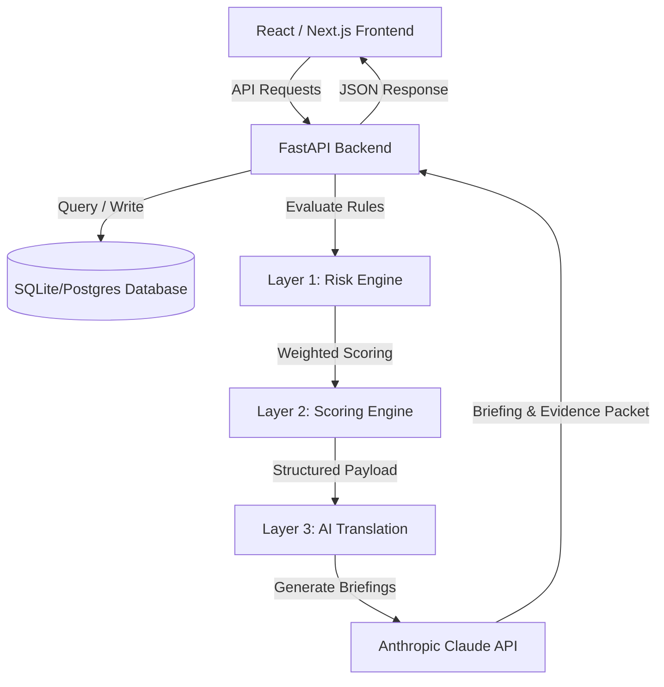

# 🛡️ SentinelGrid: Compound-Risk Detection for Industrial Safety

SentinelGrid is a cutting-edge, multi-layered risk correlation engine designed for industrial plant safety. While traditional SCADA and DCS control room systems monitor individual telemetry streams in silos (waiting for static gas alarms to cross high thresholds), SentinelGrid correlates real-time **gas sensor telemetry**, active **work permits**, and **maintenance databases** to flag compound hazards hours before they escalate into incidents.

By combining deterministic rule-based correlation (Layer 1), weighted aggregate risk scoring (Layer 2), and LLM-driven natural language safety translation (Layer 3), SentinelGrid provides site safety officers with predictive foresight, regulatory compliance mapping, and counterfactual simulation sandboxes.

---

## 🚀 Key Capabilities & Features

### 1. Interactive Facility Floor Plan
- Maps real-time hazardous conditions across six distinct plant zones (`Zone-A` through `Zone-F`).
- Highlights active risk statuses dynamically (Normal 🟢, Alert 🟡, and Danger/Escalate 🔴 with pulsing warning glows).

### 2. Multi-Layered Correlation & Safety Engine
*   **Layer 1 — Deterministic Correlation Rules**: Cross-references telemetry streams to evaluate multi-factor risks (e.g., active hot work near rising combustible gas in a zone with an overdue exhaust fan check).
*   **Layer 2 — Aggregate Risk Scoring**: Calculates a dynamic Risk Index ($0\text{ to }100$) using a weighted severity model. It applies co-firing multipliers to reflect accelerated hazard velocity when multiple conditions align.
*   **Layer 3 — AI Translation & Briefing**: Uses Claude (via Anthropic's SDK) to translate raw structured engine outputs into human-readable safety briefings and generates regulatory compliance audit logs mapped to international standards.

### 3. Counterfactual Risk Sandbox
- Empowers safety officers to play "what-if" scenarios in real-time.
- Allows operators to isolate specific permits or resolve overdue maintenance tasks and instantly observe the safety impact on the facility's Risk Index.

### 4. Replay Timeline & Historical Replay
- Includes a side-by-side reconstruction of historical incidents (such as the *Vizag Coke Oven battery gas buildup*).
- Directly compares legacy systems (which alarm only after fatal limits are crossed) against SentinelGrid (which flags a Tier 3 warning **155 minutes in advance**).

### 5. Analytical Performance Scorecard
- Evaluates SentinelGrid's compound engine against traditional single-sensor baselines.
- Measures key safety metrics: **Compound Detection Rate (100%)**, **Baseline Detection Rate (0%)**, **Average Warning Lead Time (155 minutes)**, and **Evidence Auditability (100%)**.

### 6. Incident Pattern Intelligence (RAG Search)
- **Hybrid Incident Database**: Merges 17 synthetic scenarios and 12 real-world accident records from the CSB and OSHA public investigation databases.
- **Local RAG Search & Graph Reasoning**: Implements a local sentence-transformer embedding pipeline (`all-MiniLM-L6-v2`) for semantic search of safety files, combined with multi-hop knowledge graph reasoning to link and surface textually dissimilar incidents that share underlying regulatory clauses (e.g., OSHA 1910.146) or rules.
- **Source Provenance Badging**: Displays styled badges (**Real Incident (CSB)** vs **Synthetic Scenario**) in the search console and incident log to prevent illustration data from being mistaken for real incident history.

---


## 🛠️ Architecture & Tech Stack



*   **Frontend**: Next.js 16 (App Router), TypeScript, Tailwind CSS v4, PostCSS, Mapbox-GL (Zone Layouts), Recharts (Telemetry Analytics), Lucide Icons, and Axios.
*   **Backend**: FastAPI, SQLAlchemy ORM, SQLite (local development) / PostgreSQL (production), Uvicorn, Pandas, and Numpy.
*   **AI Engine**: Anthropic Claude-3.5-Sonnet (via official SDK) with a deterministic template-driven fallback when API keys are absent.

---

## 🧮 Data Correlation Engine & Risk Model

SentinelGrid relies on two layers of scoring to calculate the overall zone risk index:

### Deterministic Risk Rules

| Rule Name | Severity | Description / Condition |
| :--- | :---: | :--- |
| `RULE_HOT_WORK_NEAR_GAS_SPIKE` | **3** | Active hot work permit in zone correlates with rising CH4 (>10% LEL), H2S (>5.0ppm), or CO (>25.0ppm) in adjacent zones. |
| `RULE_CONFINED_SPACE_NEAR_GAS_SPIKE` | **3** | Confined space entry in zone correlates with rising toxic CO (>25.0ppm) or H2S (>2.0ppm) in adjacent zones. |
| `RULE_ELECTRICAL_WORK_NEAR_GAS_SPIKE` | **2** | Electrical work permit in zone correlates with rising explosive CH4 (>10% LEL) in adjacent zones. |
| `RULE_OVERDUE_MAINTENANCE_ACTIVE_PERMIT` | **2** | Active work permit in zone matches an overdue maintenance task in the same zone. |
| `RULE_SILENT_SENSOR_DURING_PERMIT` | **2** | A gas telemetry sensor goes silent ("offline") while a permit is active in the same zone. |
| `RULE_PERMIT_DURING_ACTIVE_REPAIR` | **2** | Active permit overlaps with ongoing equipment repairs in the same zone. |

> [!NOTE]
> **Threshold Alignment with Real Standards:**
> - **Methane ($CH_4$)**: Measured in % LEL (Lower Explosive Limit) where 10% LEL matches the explosive atmosphere warnings and 20% LEL matches the high baseline alarm.
> - **Hydrogen Sulfide ($H_2S$)**: Limits align with ACGIH STEL (5 ppm), ACGIH TWA (1 ppm), and NIOSH REL Ceiling (10 ppm).
> - **Carbon Monoxide ($CO$)**: Limits align with ACGIH TWA (25 ppm) and OSHA PEL TWA (50 ppm).


### Aggregate Score & Co-Firing Multiplier
The aggregate Risk Index is calculated using the base severity of all triggered rules, adjusted by a **co-firing multiplier** to represent compound risk growth:

$$\text{Base Score} = \sum (\text{Rule Severity} \times 20)$$

$$\text{Multiplier} = \begin{cases} 
1.0 & \text{if 1 rule triggers} \\
1.3 & \text{if 2 rules trigger} \\
1.6 & \text{if } 3\text{+ rules trigger}
\end{cases}$$

$$\text{Risk Score} = \min(100, \text{Base Score} \times \text{Multiplier})$$

*   🟢 **Tier 1 (Log Only)**: Score $< 40$. Standard operation; logs are stored in audit trails.
*   🟡 **Tier 2 (Dashboard Flag)**: Score $40 - 74$. Highlighted on facility map; safety briefing prepared.
*   🔴 **Tier 3 (Escalate)**: Score $\ge 75$. Imminent threat; triggers flashing visual warnings and compiles a regulatory evidence packet.

---

## 📂 Project Directory Structure

```text
sentinel/
├── backend/
│   ├── app/
│   │   ├── data/                 # Seed scripts, generators, and JSON fixtures
│   │   ├── db/                   # Database configuration, models, and sessions
│   │   ├── engine/               # Risk engine rules, scoring, and AI narration
│   │   └── main.py               # FastAPI entry point and router endpoints
│   ├── tests/                    # Backend unit and integration tests (pytest)
│   ├── Dockerfile
│   ├── requirements.txt          # Python dependencies
│   └── sentinelgrid.db           # Local SQLite database
├── frontend/
│   ├── src/
│   │   ├── app/                  # Pages: Dashboard, Replay, Scorecard, Pattern Intelligence, Compliance Audit, Incident Log
│   │   ├── components/           # UI Elements (Sidebar, etc.)
│   │   └── globals.css           # Tailwind configuration
│   ├── Dockerfile
│   ├── package.json              # Node dependencies & npm scripts
│   └── tsconfig.json             # TypeScript configuration
├── docker-compose.yml            # Full-stack orchestrator (App + Postgres + Redis)
└── DEMO_SCRIPT.md                # Click-by-click live demo script for presentations
```

---

## ⚡ Quick Start

### Option A: Using Docker Compose (Recommended)
This launches the application with production-like services (PostgreSQL, Redis, FastAPI backend, and Next.js frontend):

1.  **Clone and navigate to the directory**:
    ```bash
    git clone https://github.com/your-repo/sentinelgrid.git
    cd sentinelgrid
    ```
2.  **Spin up the services**:
    ```bash
    docker-compose up --build
    ```
3.  **Access the applications**:
    - **Frontend**: [http://localhost:3000](http://localhost:3000)
    - **FastAPI Documentation (Swagger)**: [http://localhost:8000/docs](http://localhost:8000/docs)

---

### Option B: Local Development Setup

#### 1. Backend Setup
1.  Navigate to the backend folder and create a virtual environment:
    ```bash
    cd backend
    python -m venv venv
    ```
2.  Activate the virtual environment:
    - **Windows (PowerShell)**: `.\venv\Scripts\Activate.ps1`
    - **macOS/Linux**: `source venv/bin/activate`
3.  Install dependencies:
    ```bash
    pip install -r requirements.txt
    ```
4.  *(Optional)* Set up your Anthropic API Key:
    - Create a `.env` file in the `backend/` directory:
      ```env
      ANTHROPIC_API_KEY=your_actual_api_key_here
      ```
5.  Seed the database:
    ```bash
    python -m app.data.seed
    ```
6.  Start the dev server:
    ```bash
    uvicorn app.main:app --reload
    ```
    *The API will be available at [http://127.0.0.1:8000](http://127.0.0.1:8000).*

#### 2. Frontend Setup
1.  Navigate to the frontend folder:
    ```bash
    cd ../frontend
    ```
2.  Install dependencies:
    ```bash
    npm install
    ```
3.  Start the local development server:
    ```bash
    npm run dev
    ```
    *Open [http://localhost:3000](http://localhost:3000) in your browser.*

---

## 🧪 Running Automated Tests

A comprehensive suite of tests verifies the deterministic risk rules, counterfactual logic, and database state transitions.

Run the test suite from the `backend` directory using `pytest`:
```bash
cd backend
pytest -v
```

---

## 📝 Compliance & Regulatory Standards Mapping

When a Tier 3 (Escalate) incident occurs, Layer 3 automatically maps the compound events to official safety standards:

| Code / Clause | Standard | Context |
| :--- | :--- | :--- |
| **OISD Standard 105 (Section 5.2)** | Permit to Work Systems for Hot Work | Controls hot work near areas with potential ignition sources. |
| **OISD Standard 105 (Section 5.3)** | Safety in Confined Space Entry | Regulates entry and atmospheric gas monitoring in confined spaces. |
| **Factories Act 1948 (Section 36)** | Precautions Against Dangerous Fumes | Mandates gas testing and clearing before entering spaces containing toxic vapors. |
| **Factories Act 1948 (Section 37)** | Electrical Isolation & Spark Prevention | Controls electrical sparks in areas where explosive gases could accumulate. |
| **OISD Standard 137** | Guidelines for Inspection of Electrical Equipment | Outlines safety audit and periodic maintenance compliance for electrical equipment in hazardous zones. |

For detailed information on real cited values, CSB investigation records, and synthetic simulation components, refer to [`data_sources.md`](file:///c:/Users/Harshil%20Jain/Documents/sentinal/data_sources.md) in the project root.


---

## 🎮 Walkthrough Scenarios & Live Demo

SentinelGrid includes pre-packaged data scenarios for demonstration and testing purposes. Use the sidebar controller in the dashboard to inject these in real-time:

1.  **Nominal Baseline**: Facility operates in normal parameters. Zone status is green.
2.  **Scenario 1: Hot Work + Methane (Zone-A)**: Methane rises to 48.5 ppm (below static 20 ppm alarm in legacy systems) while hot work is active and fan maintenance is overdue. Risk score hits `100` (Tier 3 Danger).
3.  **Scenario 2: Confined Space + Carbon Monoxide (Zone-B)**: Toxic CO builds up inside a confined space during active entry while detector calibration is overdue. Risk score hits `100` (Tier 3 Danger).
4.  **Scenario 3: Hot Work + Hydrogen Sulfide (Zone-C)**: Highly lethal H2S gas accumulates during hot work while an active valve repair is underway. Risk score hits `100` (Tier 3 Danger).
5.  **Scenario 4: Electrical Permit + Methane (Zone-D)**: Spark-prone electrical work matches a methane gas leak. Risk score hits `100` (Tier 3 Danger).
6.  **Silent Failure (Zone-E)**: Confined space entry is active, but telemetry sensors go completely offline (silent status). Risk score hits `60` (Tier 2 Warning) due to loss of visibility.
7.  **Reset Demo DB**: Click "Reset Demo DB" in the frontend sidebar anytime to wipe the database and restore the clean baseline state.
